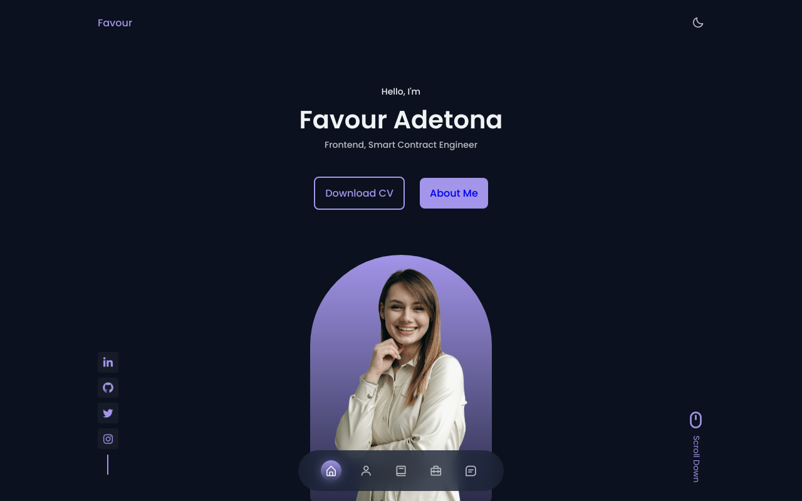

# Responsive Portfolio Website


## Table of contents

- [Overview](#overview)
  - [The challenge](#the-challenge)
  - [Screenshot](#screenshot)
  - [Links](#links)
- [My process](#my-process)
  - [Built with](#built-with)
  - [What I learned](#what-i-learned)
  - [Continued development](#continued-development)
- [Author](#author)
- [Acknowledgments](#acknowledgments)

**Note: Delete this note and update the table of contents based on what sections you keep.**

## Overview


### Screenshot





### Links

- Solution URL: [solution](https://portfolio-seven-sooty-93.vercel.app/)

## My process

### Built with

- Semantic HTML5 markup
- CSS custom properties
- Flexbox
- CSS Grid
- Mobile-first workflow
- [Swiper.js](https://swiperjs.com/) - JS library for component swipe
- [mixitup.js](https://www.kunkalabs.com/mixitup/) - JS library
- [Scrollreveal](https://scrollrevealjs.org/) - JS library


### What I learned

To see how you can add code snippets, see below:

```html
<h1>Some HTML code I'm proud of</h1>
```
```css
.proud-of-this-css {
  color: papayawhip;
}
```
```js
const proudOfThisFunc = () => {
  console.log('🎉')
}
```


### Continued development

I have plans to create this portfolio with next.js.


## Author

- Twitter - [@0xfavouradetona](https://www.twitter.com/0xfavouradetona)


## Acknowledgments

Thank you Bedmcode for the [video](https://www.youtube.com/watch?v=oy8dSsK57Ps)

